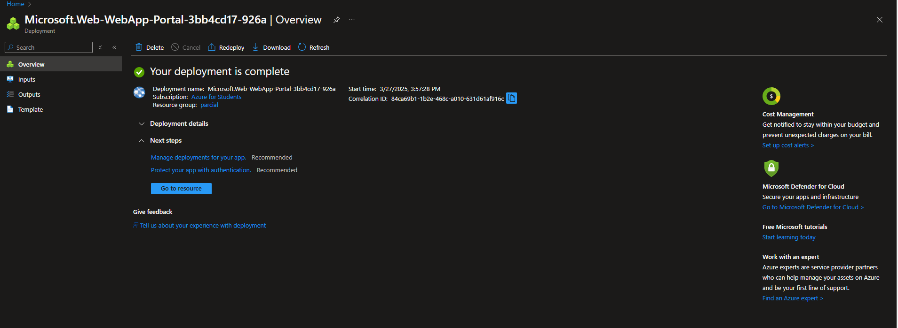

Juan Sebastian Velandia Pedraza

El diagram de clases para el paquete de modelo seria el siguiente:

Las pruebas en jacoco estan al:

Funcionamiento en Postman

Despliegue con integracion CI/CD

Y en este proyecto se usaron Java Springboot, debido a la falta de front, el uso de postman y las pruebas unitarias hablan en favor del funcionamiento de la aplicacion